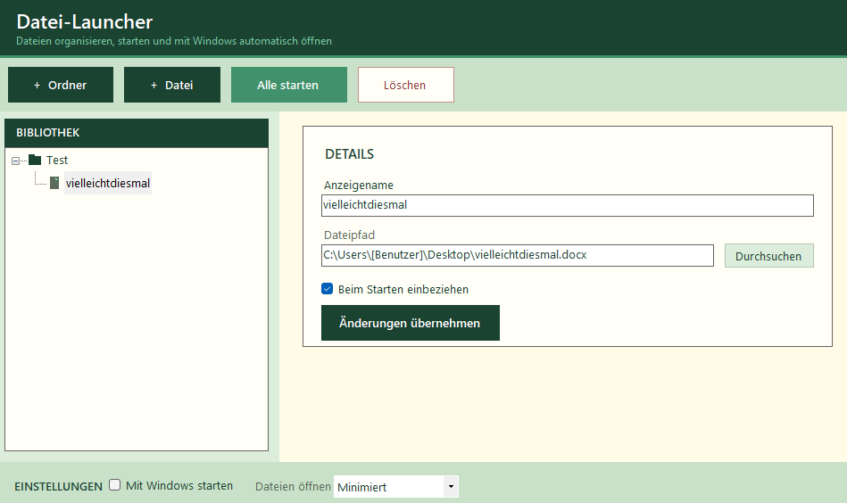

<div align="center">

# Multiple File Launcher

**Launch your daily files and apps in one click — organized, automated, and duplicate-safe.**

[](https://dotnet.microsoft.com/)
[](https://www.microsoft.com/windows)
[](https://learn.microsoft.com/en-us/dotnet/desktop/winforms/)

<br>

<!-- Replace the path below with your actual screenshot -->


<br><br>

[Features](#features) · [How It Works](#how-it-works) · [Getting Started](#getting-started) · [Configuration](#configuration) · [Project Structure](#project-structure)

</div>

---

## Overview

**Multiple File Launcher** is a lightweight Windows desktop app that lets you build a personal launch list — grouped in folders — and open everything with a single button. Perfect for morning routines, dev environments, streaming setups, or any workflow where you always open the same set of files and programs.

Instead of clicking through shortcuts one by one, define your list once and let the app handle the rest — including skipping files that are already open.

---

## Features

| | |
|---|---|
| **Tree-based organization** | Group files into nested folders with drag-and-drop reordering |
| **Launch all at once** | One click launches every enabled file in your list |
| **Launch individually** | Double-click any file entry to open it on its own |
| **Duplicate detection** | Skips files already open — no duplicate windows or locked-file errors |
| **Window state control** | Choose how launched windows appear: Normal, Maximized, or Minimized |
| **Start with Windows** | Optionally auto-launch your list when you log in |
| **Persistent settings** | Your list is saved automatically to `%AppData%\MultipleFileLauncher` |
| **Per-file toggle** | Enable or disable individual entries without removing them |

---

## How It Works

```
┌─────────────────────────────────────────────────────────────┐
│                     Multiple File Launcher                  │
│                                                             │
│   ┌──────────────┐    ┌─────────────┐    ┌──────────────┐  │
│   │  Tree View   │───▶│  Settings   │───▶│  File Launch │  │
│   │  (Folders &  │    │  (JSON in   │    │  Engine      │  │
│   │   Files)     │    │   AppData)  │    │              │  │
│   └──────────────┘    └─────────────┘    └──────┬───────┘  │
│                                                  │          │
│                              ┌───────────────────┼──────┐  │
│                              ▼                   ▼      ▼  │
│                     Already open?          ShellExecute   Fallback │
│                     (skip launch)          + window     Process.Start │
│                                            state        │
└─────────────────────────────────────────────────────────────┘
```

### Launch flow

1. **Collect** — The app walks your tree and gathers all enabled file entries.
2. **Check** — For each file, it checks whether the target is already running (executables via process name, documents via Windows Restart Manager).
3. **Launch** — Files are opened through `ShellExecuteEx`, respecting your chosen window state.
4. **Apply window state** — If needed, the app polls for the new process window and applies Minimized or Maximized as a fallback.

### Startup mode

When **Start with Windows** is enabled, a registry entry runs the app with the `--startup` flag on login. In this mode the UI stays hidden and only the launch sequence runs — your files open silently in the background.

---

## Getting Started

### Requirements

- Windows 10 or later
- [.NET 10 SDK](https://dotnet.microsoft.com/download)

### Build & Run

```bash
git clone <repository-url>
cd MultipleFileLauncher
dotnet build
dotnet run --project MultipleFileLauncher
```

### Publish (optional)

```bash
dotnet publish MultipleFileLauncher -c Release -r win-x64 --self-contained
```

The executable will be in `MultipleFileLauncher/bin/Release/net10.0-windows/win-x64/publish/`.

---

## Usage

### Managing your launch list

| Action | How |
|---|---|
| Add a folder | Click **Add Folder**, enter a name |
| Add files | Select a folder (or root), click **Add File**, pick one or more files |
| Edit an entry | Select it in the tree, change name/path/enabled state, click **Apply** |
| Reorder / move | Drag and drop items in the tree |
| Delete | Select an item and click **Delete** |
| Launch one file | Double-click the file entry |
| Launch everything | Click **Launch All** |

### Settings

- **Window state** — Controls how newly launched windows appear (Normal / Maximized / Minimized).
- **Start with Windows** — Registers the app in the Windows Run key so your list launches at login.

---

## Configuration

Settings are stored as JSON at:

```
%AppData%\MultipleFileLauncher\settings.json
```

Example structure:

```json
{
  "rootItems": [
    {
      "$type": "folder",
      "id": "abc-123",
      "name": "Work",
      "children": [
        {
          "$type": "file",
          "id": "def-456",
          "name": "Project",
          "path": "C:\\Projects\\app.sln",
          "enabled": true
        }
      ]
    }
  ],
  "startWithWindows": true,
  "launchWindowState": "Minimized"
}
```

---

## Project Structure

```
MultipleFileLauncher/
├── Form1.cs              # Main UI — tree view, detail panel, drag-and-drop
├── FileLauncher.cs       # Launch orchestration and window-state fallback
├── ShellLauncher.cs      # ShellExecuteEx P/Invoke wrapper
├── RunningFileChecker.cs # Duplicate detection (process + Restart Manager)
├── WindowFinder.cs       # Finds main windows for a process
├── StartupManager.cs     # Windows Run registry integration
├── AppSettings.cs        # JSON persistence and tree operations
├── Models/
│   └── LaunchItem.cs     # LaunchFile & LaunchFolder models
└── Program.cs            # Entry point (UI or --startup mode)
```

---

## Tech Stack

- **.NET 10** — Target framework
- **Windows Forms** — Native desktop UI
- **System.Text.Json** — Settings serialization
- **Win32 API** — `ShellExecuteEx`, `ShowWindowAsync`, Restart Manager

---

<div align="center">

Made for people who open the same files every day — and want that back.

</div>
